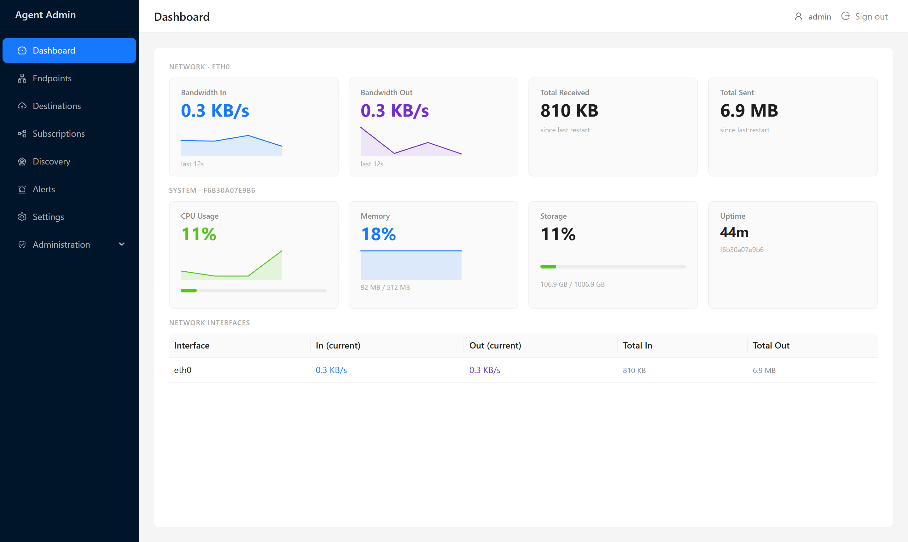
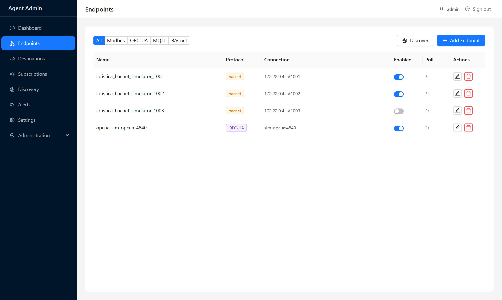
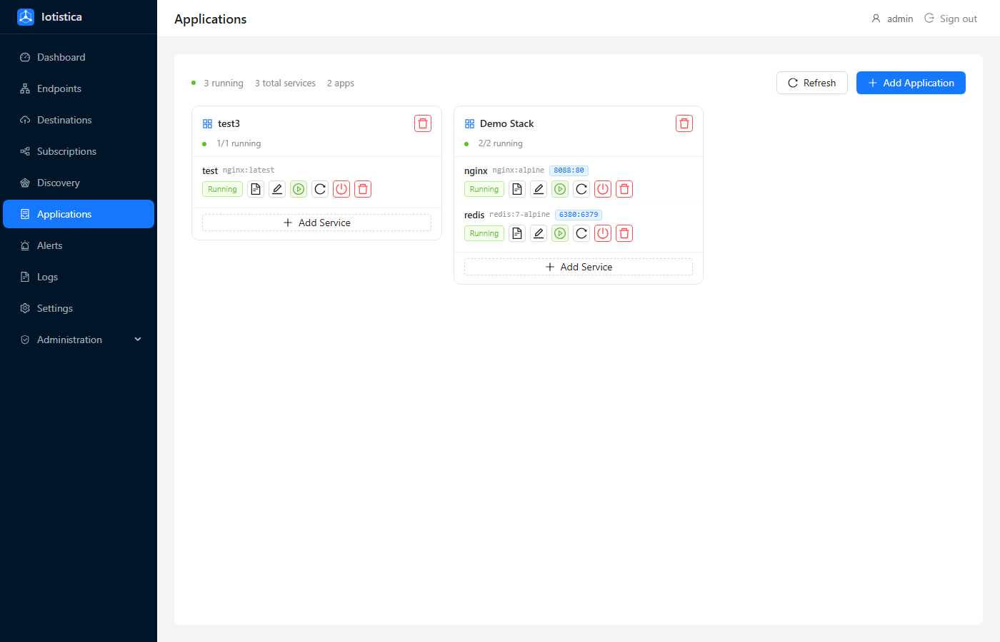
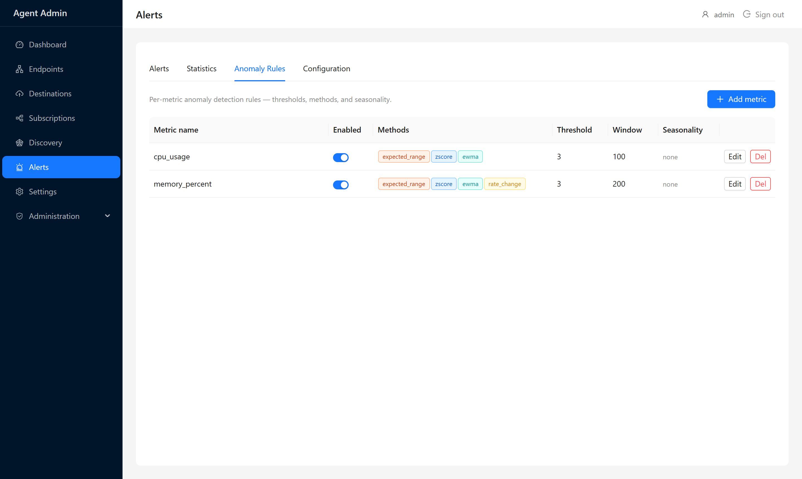

# Iotistica

Iotistica is an IoT fleet management platform built around a lightweight edge agent. The agent runs on industrial hardware, bridges field devices over Modbus, OPC-UA, BACnet, SNMP, and CAN, orchestrates Docker applications via cloud-pushed target state, streams telemetry to configurable upstream destinations, and performs on-device anomaly detection — all designed to operate reliably with intermittent or no cloud connectivity.



---

## What's in this repo

| Directory | Description |
|-----------|-------------|
| `agent/` | Edge runtime deployed on IoT hardware (Node.js 20 / TypeScript) |
| `mosquitto-agent/` | MQTT broker auth sidecar |
| `website/` | Docusaurus documentation site |
| `simulators/` | Sensor data simulators for development |
| `influxdb/` | InfluxDB configuration |
| `grafana/` | Grafana dashboards |

---

## Agent

The agent is the core component. It runs on edge hardware and handles:

- **Container orchestration** — pulls Docker images, reconciles running containers against a desired target state pushed from the cloud
- **Industrial protocols** — Modbus TCP/RTU, OPC-UA, BACnet, SNMP, MQTT broker, CAN bus
- **Data publishing** — forwards sensor readings to MQTT, InfluxDB, Azure IoT Hub, AWS IoT Core, GCP IoT Core
- **Anomaly detection** — edge ML baseline tracking with per-metric alert rules, no cloud round-trip required
- **Cloud sync** — polls target state every 60s, reports current state every 10s, buffers everything to SQLite during outages
- **Device discovery** — scans networks for industrial devices and auto-registers endpoints
- **Remote shell** — HMAC-signed, MQTT-delivered interactive shell sessions
- **VPN** — Tailscale integration for secure remote access

### Admin UI



The agent ships a local admin UI (Vue 3 + Ant Design Vue) served at `http://<device>:48481/admin/`.



---

## Quick Start

### Standalone (no cloud)

Run the agent fully offline with local configuration:

```bash
cd agent
cp .env.example .env        # set DATA_DIR, LOG_DIR, etc.
npm install
npm run build
STANDALONE=true node dist/app.js
```

Open the admin UI at `http://localhost:48481/admin/`.

### Docker (recommended)

```bash
docker build -t iotistica-agent ./agent

docker run -d \
  --name iotistica-agent \
  -p 48481:48484 \
  -v /var/run/docker.sock:/var/run/docker.sock \
  -v $(pwd)/data:/data \
  -e STANDALONE=true \
  iotistica-agent
```

### Cloud-connected

```bash
docker run -d \
  --name iotistica-agent \
  -p 48481:48484 \
  -v /var/run/docker.sock:/var/run/docker.sock \
  -v $(pwd)/data:/data \
  -e IOTISTICA_API=https://api.iotistica.io \
  -e PROVISIONING_KEY=your-one-time-key \
  iotistica-agent
```

On first boot, the agent runs a three-phase provisioning protocol (register → Ed25519 proof-of-possession → discard key) and then syncs state continuously.

---

## Key Environment Variables

| Variable | Default | Description |
|----------|---------|-------------|
| `STANDALONE` | `false` | Set to `true` to disable all cloud sync and run fully offline |
| `IOTISTICA_API` | — | Iotistica Cloud API base URL |
| `PROVISIONING_KEY` | — | One-time provisioning token (not needed after first boot) |
| `MQTT_BROKER_URL` | — | Cloud MQTT broker URL for real-time state push |
| `DEVICE_API_PORT` | `48484` | Local HTTP API port |
| `DATA_DIR` | — | Writable directory for SQLite database and keys |
| `LOG_DIR` | — | Log file directory |
| `LOG_LEVEL` | `info` | `debug`, `info`, `warn`, `error` |
| `ANOMALY_DETECTION_ENABLED` | `true` | Enable edge anomaly detection |
| `ENABLE_AUTH` | `false` | Require `X-Api-Key` header on Device API |
| `API_KEY` | — | API key value when `ENABLE_AUTH=true` |

---

## Architecture

```
Cloud desired state (MQTT / REST)
          │
     StateManager          ← SQLite (persistent, offline-buffered)
          │
   Reconciliation loop
          │
   Docker containers / Protocol adapters (current state)
          │
   Data publishing pipeline
          │
   Upstream destinations (MQTT, InfluxDB, Azure, AWS, GCP)
```

The agent is **offline-first**. When the cloud is unreachable:
- All outgoing state reports buffer to SQLite and flush when connectivity returns
- Sensor data publishing buffers per-destination, drops oldest when full (configurable, default 10 000 records)
- Target state from the last successful pull remains in effect — containers keep running

---

## Agent Startup Phases

```
node dist/app.js
  └─ src/app.ts
       └─ agent.init()   6-phase async init:
            1. core       DB, StateManager, ConfigManager
            2. logging    AgentLogger (local + cloud backends)
            3. infra      ContainerManager, MQTT, HTTP client
            4. device     Provisioning, Device API (port 48484)
            5. features   Anomaly, discovery, remote access, jobs
            6. sync       Cloud polling + reporting
```

---

## Device API

The agent exposes a local REST API on port 48484. Every action in the admin UI is backed by this API.

```
GET  /ping
GET  /v1/healthy
GET  /v1/readiness
GET  /v1/health/report
GET  /v1/buffer/status
GET  /v1/device
GET  /v1/apps
POST /v1/apps
POST /v1/provision
GET  /v1/endpoints
POST /v1/endpoints
GET  /v1/anomaly/alerts
PATCH /v1/anomaly/config
GET  /v1/logs
GET  /v1/settings
...
```

See the full [Agent API reference](website/documentation-site/docs/references/agent-api.mdx) or the built documentation site.

---

## Industrial Protocols

| Protocol | Transport | Notes |
|----------|-----------|-------|
| Modbus | TCP, RTU (serial) | Register read/write, multi-device polling |
| OPC-UA | TCP | Address space browsing, security modes, session auth |
| BACnet | IP | Object discovery, COV subscriptions |
| SNMP | UDP | v1/v2c/v3 |
| MQTT | TCP/TLS | Acts as subscriber on a local broker |
| CAN bus | SocketCAN | Frame-level read |

---

## Data Publishing Formats

Three payload formats are available per subscription:

| Format | Best for |
|--------|----------|
| `custom` | Iotistica Cloud, custom consumers — full batch envelope with quality codes and msgId deduplication |
| `tags` | Generic MQTT consumers — flat tag list with Unix-ms timestamp |
| `ecp` | Typed time-series databases — explicit type metadata, omits BAD/null values |

Compression options: `json`, `msgpack`, `json+deflate`, `msgpack+deflate`.

---

## Security

- **Provisioning** — Ed25519 proof-of-possession key exchange; provisioning token destroyed after use; UUID immutable post-registration
- **Credential storage** — AES-256-GCM with unique IV per record; master key at `chmod 0600`
- **Remote shell** — HMAC-SHA256 on every command, 30s anti-replay window, device UUID binding, shell allowlist, privilege drop to UID 1000
- **Firewall** — custom `IOTISTIC-FIREWALL` iptables chain; Device API blocked externally; MQTT restricted to LAN + Docker subnets; IPv4 + IPv6

See the [Security documentation](website/documentation-site/docs/agent/security.mdx) for full details.

---

## Development

```bash
# Install dependencies
cd agent && npm install

# Build
npm run build               # tsc → dist/

# Development (watch mode)
npm run dev                 # tsx watch src/app.ts

# Tests
npm test                    # Jest unit tests
npm run test:integration    # Integration tests (requires running SQLite)
```

### Admin UI

```bash
cd agent/admin
npm install
npm run dev     # Vite dev server at http://localhost:5173
npm run build   # Build into agent/admin/dist/
```

---

## Documentation

Full documentation is in `website/documentation-site/`. To run locally:

```bash
cd website/documentation-site
npm install
npm start       # http://localhost:3000
npm run build   # Production build
```

Sections:

- **Agent** — overview, quickstart, configuration, endpoints, destinations, subscriptions, data publishing, discovery, applications, alerts, settings, cloud sync, security, CLI
- **Agent API** — full REST API reference
- **Iotistica API** — cloud API reference

---

## Anomaly Detection

The agent runs an edge ML anomaly detection engine with no cloud dependency:

- Baseline statistics (mean, std dev, median, MAD) computed from a rolling window of observed values
- Per-metric sensitivity and threshold configuration
- Three detection methods combined: z-score, IQR, and trend
- Anomaly scores enriched with predicted next value, trend direction, forecast confidence, and time-to-threshold
- Alerts stored in memory; baselines persisted to SQLite and survive restarts
- Configuration hot-reloadable via `PATCH /v1/anomaly/config` without restarting



---

## License

[MIT](LICENSE)

---

## Support

- **Issues**: [GitHub Issues](https://github.com/Iotistica/iotistica/issues)
- **Documentation**: See `website/documentation-site/`
